# HAVU Gamification — Käyttöopas

## Yleiskatsaus

HAVU Gamification on sijaintipohjainen ulkoilupelialusta. Ylläpitäjät voivat luoda reittejä lisäämällä kartalle rasteja. Rasteille voi syöttää sisältöä (esim. Infoa lähiympäristön luonnosta, eläimistä, nähtävyyksistä, jne.), ja pelaajat seuraavat näitä reittejä oikeassa maailmassa puhelimensa GPS:n avulla.

Voit kirjautua HAVU Gamificationiin osoitteessa [https://jansoftworks.fi/HavuGamification/](https://jansoftworks.fi/HavuGamification/) 

Käyttäjätiedot on toimitettu erikseen. Klikkaa kirjaudu sisään ja käytä saamiasi tunnuksia.

---

## Ylläpitäjille

**Kaikki ylläpitosivut vaativat sisäänkirjautumisen.**

### Hallintapaneeli (pages/admin/dashboard.php)

Päänäkymä. Täältä voit:

- Siirtyä reittien hallintaan (1: luominen, 2: muokkaaminen, 3: poistaminen).

    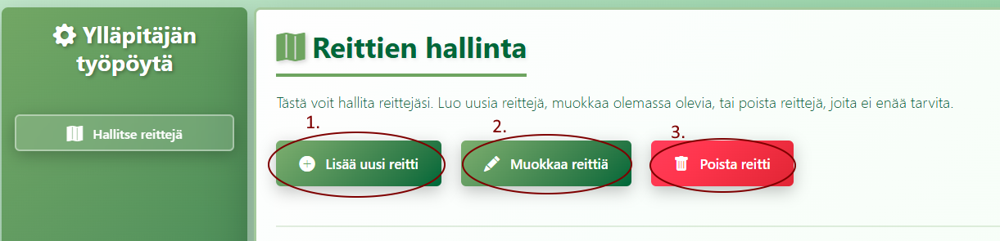

- Testata reittiä: 
  - 1: Valitse reitti pudotusvalikosta
  - 2: Klikkaa Pelaa avataksesi sen pelitilassa.
    
  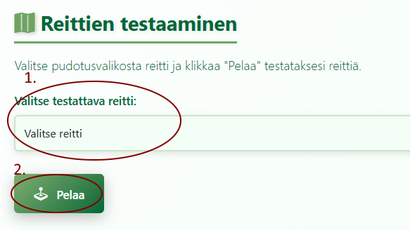

---

### Reitin luominen (pages/admin/new-route.php)

Reitin ensimmäinen rasti toimii lähtöpisteenä ja viimeinen rasti maalina. Voit muuttaa rastien järjestystä listalla. Rastit kuljetaan reitillä listan järjestyksessä ylhäältä alas.

1. Syötä reitin nimi (pakollinen) ja valinnainen kuvaus.
2. Julkaisupäivämäärä asetetaan automaattisesti tähän päivään.
    
   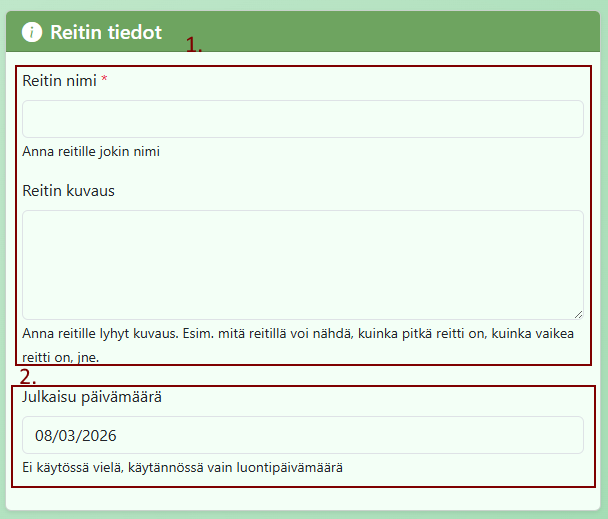

3. Klikkaa karttaa lisätäksesi rasteja. Rastien muokkausnäkymä avautuu. (1)
4. Täytä jokaiselle rastille:
   - 2: Rastin otsikko (pakollinen)
   - 3: Rastin sisältö — teksti, joka näytetään pelaajille, kun he saapuvat paikalle
   - 4: Tallenna rastin tiedot.
   - **HUOM! Jos klikkaat "Peruuta", rastin tietoja ei tallenneta, mutta merkki jää kartalle. Voit klikata sitä uudestaan myöhemmin ja syöttää tiedot. Tai klikata rastilistalta roskakorikuvaketta poistaaksesi sen kokonaan.**

   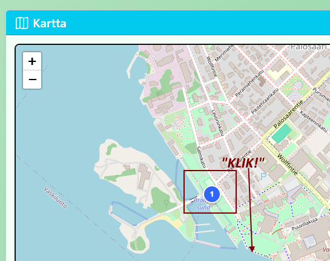
   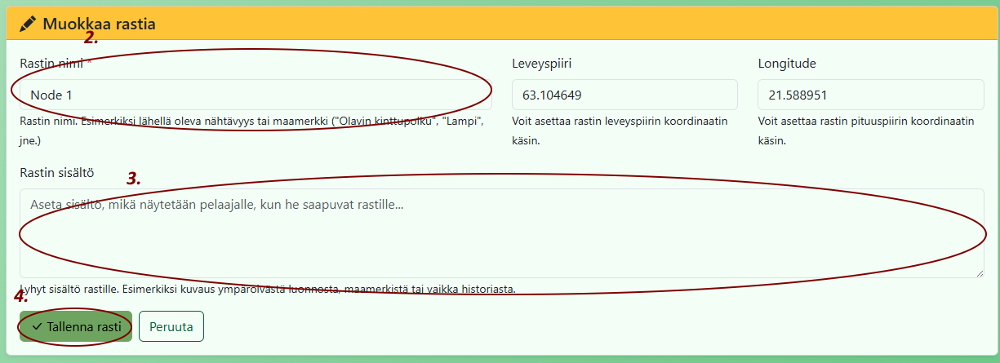

5. Käytä nuolipainikkeita rastien järjestyksen muuttamiseen.
6. Käytä roskakorikuvaketta rastin poistamiseen.
7. Vedä merkkiä kartalla hienosäätääksesi sen sijaintia.

    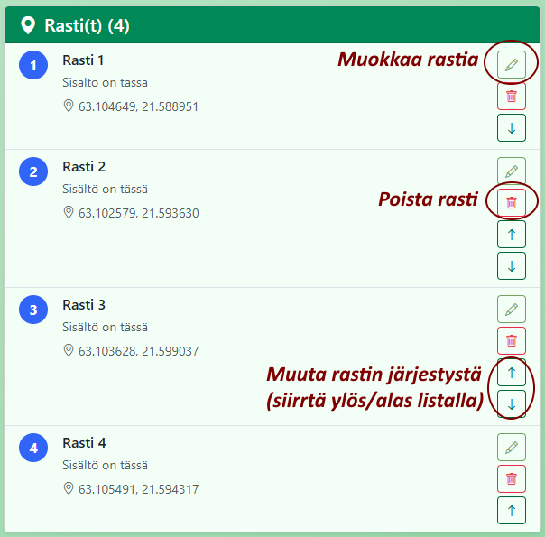

8. Klikkaa Luo reitti, kun olet valmis.
    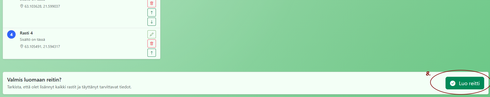

---

### Reitin muokkaaminen (pages/admin/edit-route.php)

Reitin muokkaus toimii samalla tavalla kuin luominen, mutta sinun on ensin ladattava olemassa oleva reitti muokkausnäkymään.

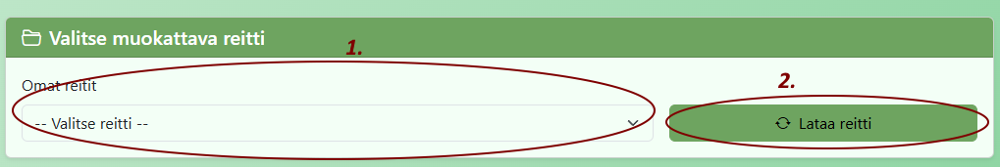

1. Valitse muokattava reitti "Valitse muokattava reitti" -pudotusvalikosta ja klikkaa Lataa reitti.
2. Olemassa olevat solmut ja reitin tiedot latautuvat muokkausnäkymään.
3. Muokkaa otsikkoa, kuvausta, julkaisupäivämäärää tai solmuja tarpeen mukaan (samat toiminnot kuin luomisessa).
4. Klikkaa Tallenna muutokset päivittääksesi reitin tiedot.

---

### Reitin poistaminen (pages/admin/delete-route.php)

1. Valitse poistettava reitti pudotusvalikosta.
2. Klikkaa Poista valittu reitti ja vahvista pyyntö.
   - **HUOM! Tätä toimintoa ei voi peruuttaa!**
3. Klikkaa Takaisin hallintapaneeliin palataksesi poistamatta.

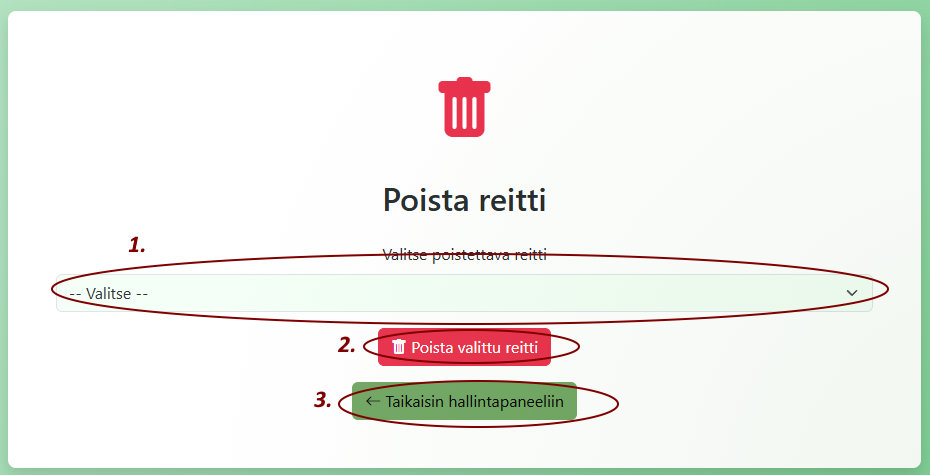

---

## Pelaajille

**HUOM! Pelaajille ei ole vielä erillistä versiota. Tällä hetkellä reittjä voi testata vain ylläpitäjät.**

### Reitin pelaaminen/Testaaminen (pages/game.php)

1. Avaa peli linkin kautta tai Hallintapaneelin "Reitin testaus" -osiosta.
2. Salli sijaintitietojen käyttö, kun selain pyytää — GPS on pakollinen.
3. Kartta latautuu ja näyttää reitin katkoviivana värillisine merkkeineen:
   - Vihreä = Aloitussolmu
   - Kulta = Maalisolmu
   - Punainen = Vierailemattomat solmut
   - Sininen piste = Nykyinen sijaintisi
   
   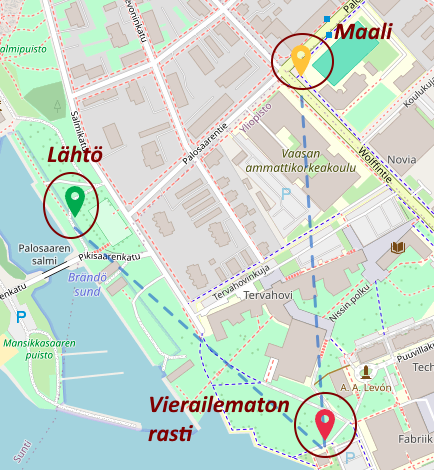

4. Kävele kohti solmua. Kun olet 50 metrin sisällä, ponnahdusikkuna avautuu automaattisesti ja näyttää solmun sisällön.
   - **HUOM!** Jos ponnahdusikkuna ei avaudu, varmista että sijaintipalvelut ovat käytössä ja että olet riittävän lähellä solmua. Voit myös klikata solmun merkkiä kartalla avataksesi ponnahdusikkunan käsin.
5. Klikkaa "Merkitse vierailluksi" ponnahdusikkunassa kerätäksesi solmun ja ansaitaksesi tammenterhon.
   
    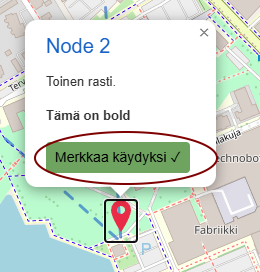

6. Edistymispalkki alareunassa seuraa, kuinka monta solmua olet suorittanut.
7. Tietopaneeli (paina reitin nimen painiketta yläreunassa) näyttää tammenterhomääräsi ja etäisyyden seuraavaan solmuun.

   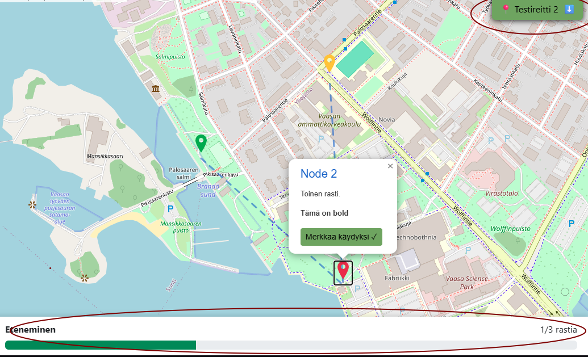

   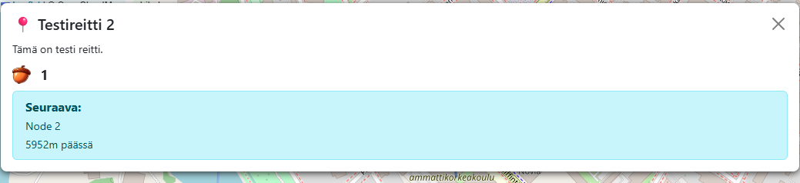

8. Kun kaikki solmut on vierailtu, näytölle ilmestyy onnitteluviesti.
