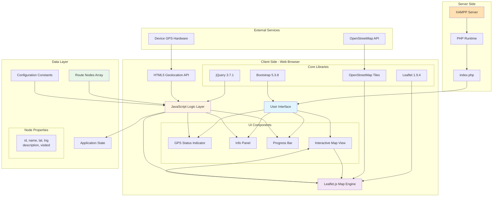
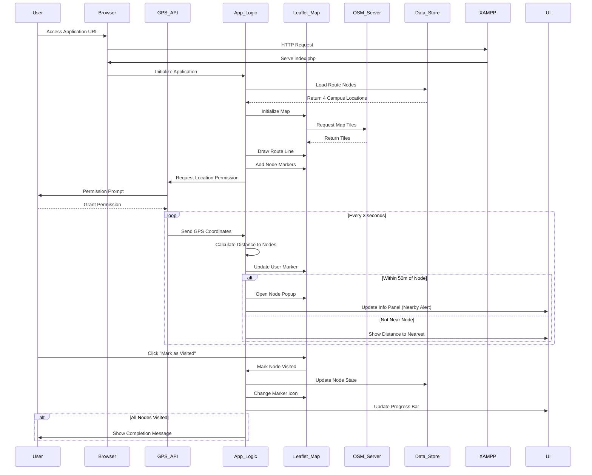
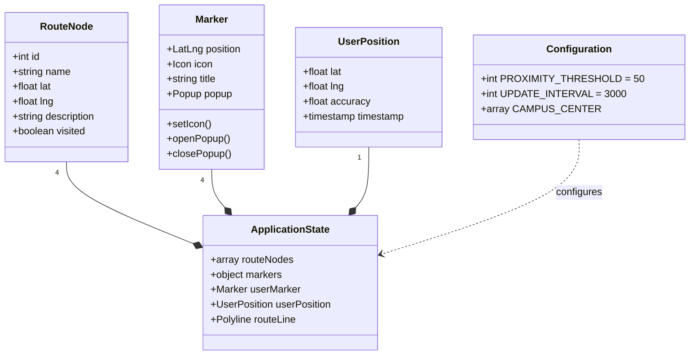
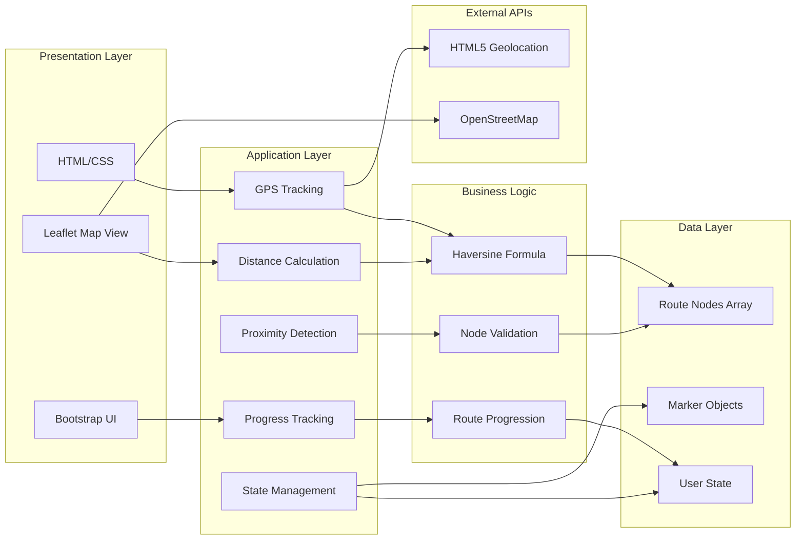
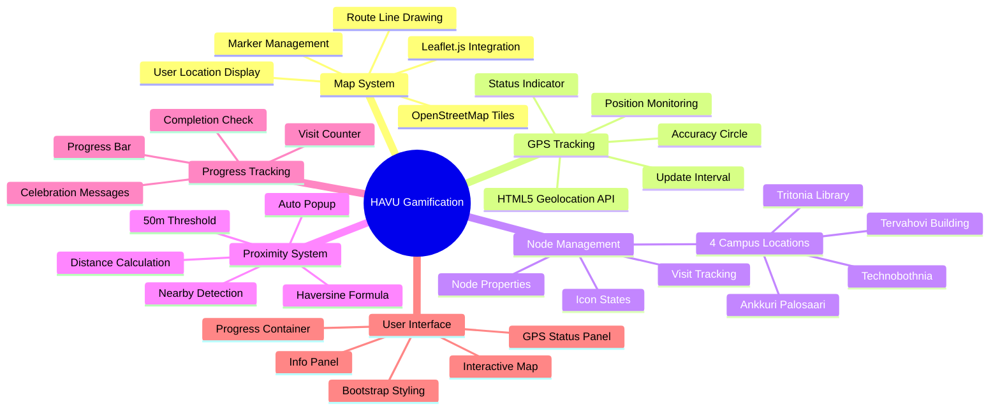
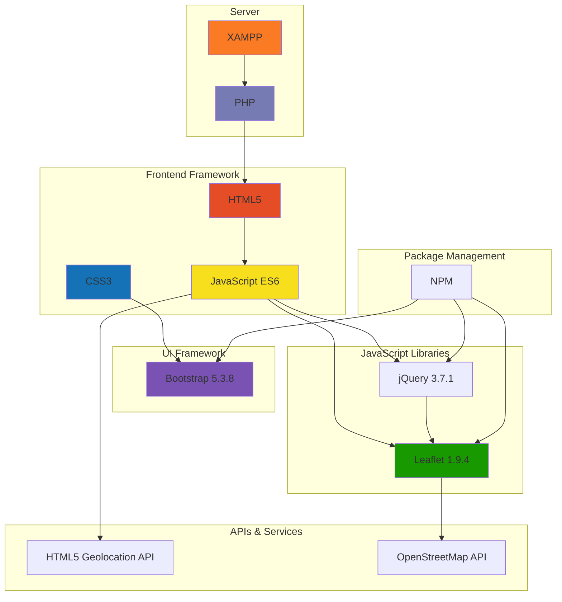
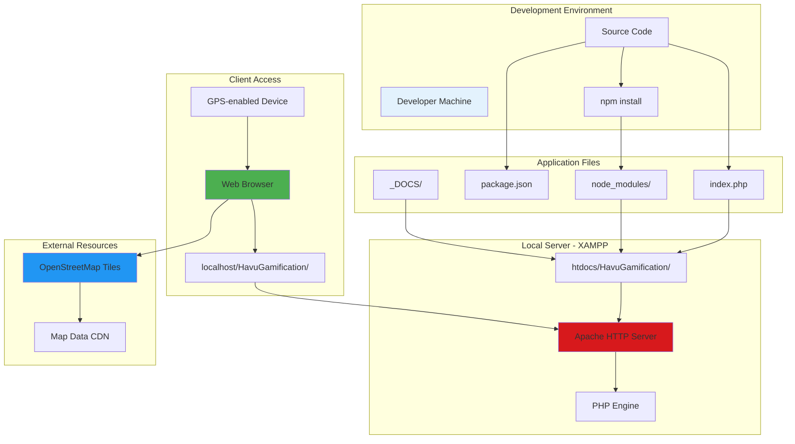

# HAVU Gamification - System Architecture

## Architecture Overview

## Component Flow Diagram

## Data Structure

## System Layers

## Feature Module Breakdown

## Technology Stack

## Deployment Architecture

